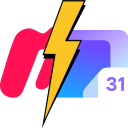

# Meetup.com → Proton Calendar



Chromium browser extension adding "Add to calendar" button on meetup.com for Proton Calendar.

## Usage

This extension adds a "Proton Calendar" option the "Add to calendar" function of meetup.com events.


After pressing the "Proton Calendar" button, Proton Calendar will be opened, and a red outline is added on the "New event" button.


Pressing the "New event" button opens the corresponding form and the extension fills out the fields for you.
If the date is not correctly filled out in the form by the extension it has to be done manually (For that reason the Meetup event date is in front of the form field.).


## Installation

1. Clone the repository
2. In a chromium based browser go to chrome://extensions and enable "Developer mode"
3. Press "Load unpacked" and select the repository folder

## Extension icon credit

The extension consists of the meetup.com + Proton Calendar logo with a lightning blot in between.

### Meetup.com logo

https://commons.wikimedia.org/wiki/File:Meetup.png

### Proton Calendar logo

https://commons.wikimedia.org/wiki/File:Proton_Calendar_Logo.svg

### Lightning Blot icon

https://www.pngkey.com/detail/u2t4e6r5i1e6o0u2_free-png-download-lightning-bolt-png-images-background/

```
Free Png Download Lightning Bolt Png Images Background - Transparent Icon Png Lightning Bolt is a free transparent PNG image carefully selected by PNGkey.com.
```
